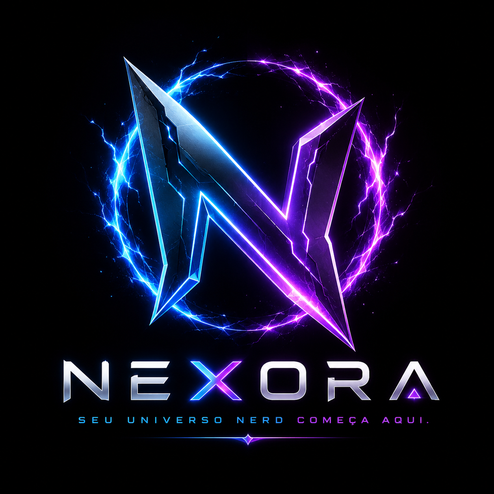

# 🚀 Nexora

  

## Sobre o projeto

O Nexora é uma plataforma de rede social moderna desenvolvida para compartilhar frases curtas, fotos e vídeos de forma rápida, intuitiva e segura.

Nosso objetivo é conectar pessoas através de conteúdos autênticos, oferecendo uma experiência simples, leve e inovadora.

---

## Principais recursos

- 📸 Publicação de fotos
- 🎥 Vídeos curtos
- 💬 Frases e pensamentos
- ❤️ Curtidas
- 💭 Comentários
- 🔄 Compartilhamentos
- 👤 Perfis personalizados
- 🔒 Segurança e privacidade

---

## Tecnologias

- HTML5
- CSS3
- JavaScript
- React
- Node.js
- GitHub

---

## Status do projeto

🚧 Em desenvolvimento.

---

## Licença

Este projeto é de propriedade da equipe Nexora. Todos os direitos reservados.
